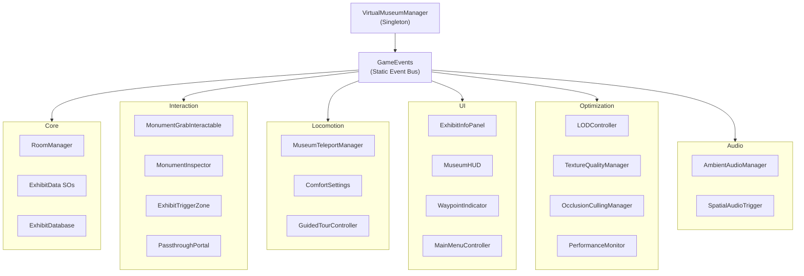
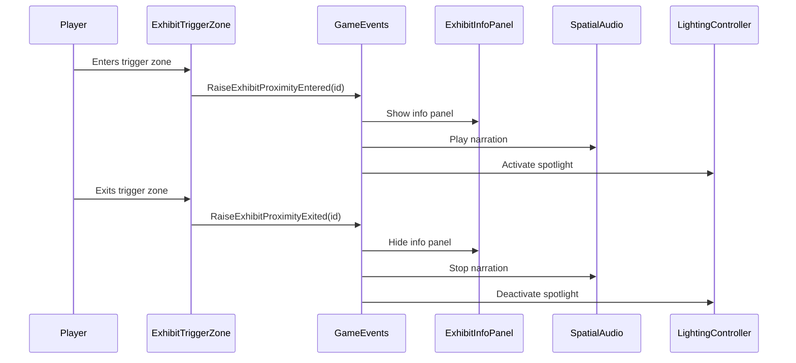
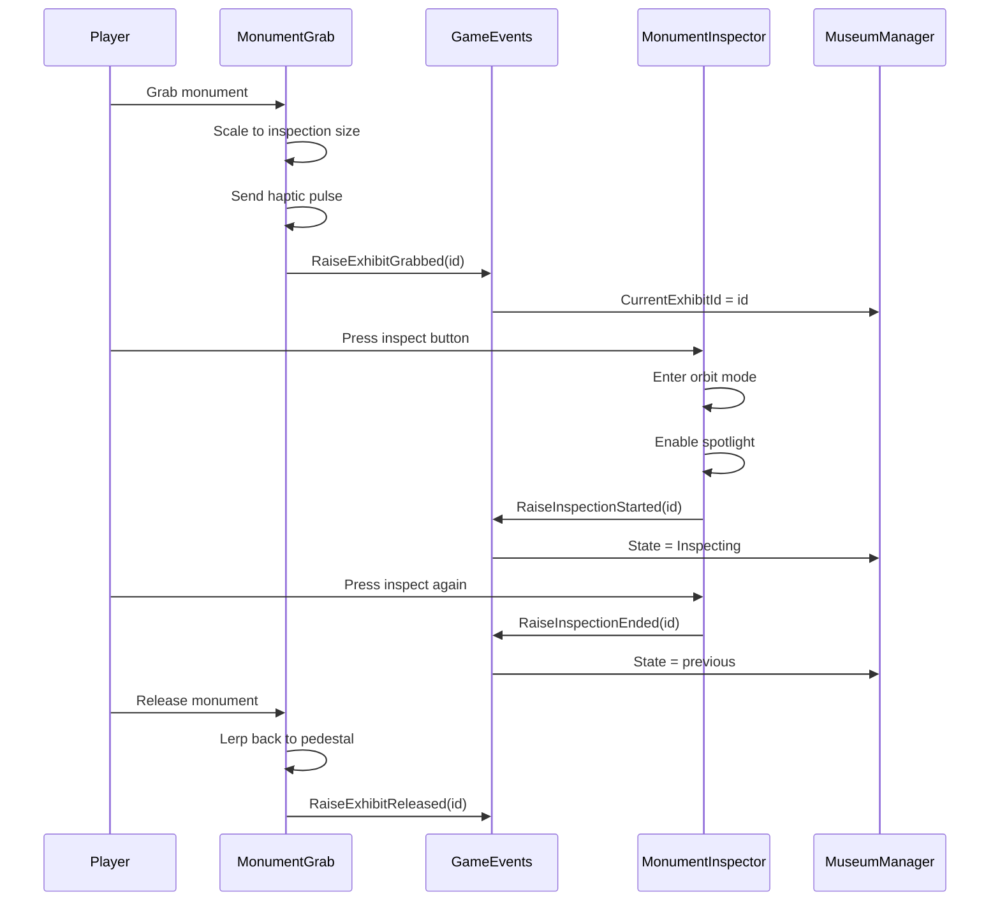
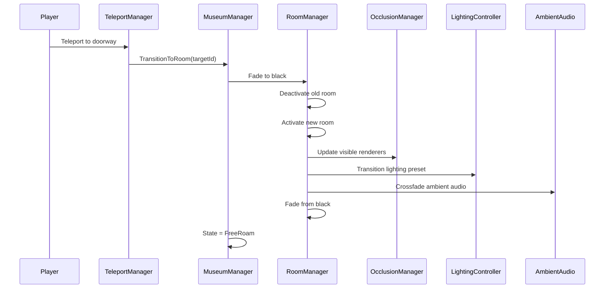
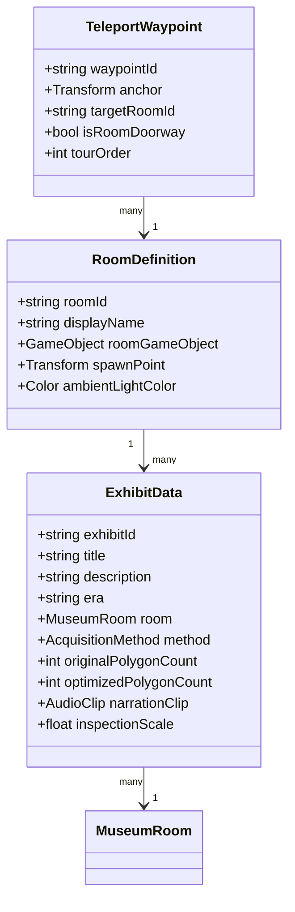

# Architecture — System Design

## System Overview



---

## Event Flow

All inter-system communication uses `GameEvents.cs` (static event bus):



---

## Grab & Inspect Flow



---

## Room Transition Flow



---

## Data Model



---

## Namespace Structure

```
VirtualMuseumVR/
├── Core/           — VirtualMuseumManager, RoomManager, ExhibitData, GameEvents
├── Interaction/    — MonumentGrabInteractable, MonumentInspector, ExhibitTriggerZone, PassthroughPortal
├── Locomotion/     — MuseumTeleportManager, ComfortSettings, GuidedTourController
├── UI/             — ExhibitInfoPanel, MuseumHUD, WaypointIndicator, MainMenuController
├── Environment/    — MuseumArchitectureBuilder, LightingController, PedestalController, AmbientParticleSystem
├── Optimization/   — LODController, TextureQualityManager, OcclusionCullingManager, PerformanceMonitor
├── Audio/          — AmbientAudioManager, SpatialAudioTrigger
├── Data/           — ExhibitDatabase
└── Editor/         — MuseumSetupWizard, ModelImportProcessor, ExhibitDataEditor
```
